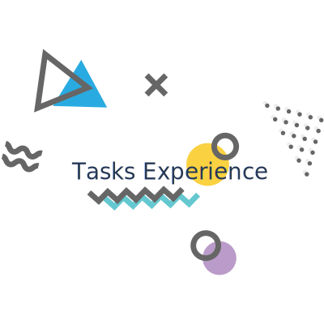

Tasks Experience
=============

**Tasks Experience** é um ToDo list, simples de organizar suas tarefas com uma linda interface e pensado na usabilidade.
Tenha uma visão geral de tudo o que tem para fazer e nunca perca o controle de uma tarefa importante.

	Este projeto foi gerado com [CLI Angular] versão 6.1.1

## Servidor de desenvolvimento

Execute `ng serve` para um servidor dev. Navegue até `http: // localhost: 4200 /`. O aplicativo será recarregado automaticamente se você alterar qualquer um dos arquivos de origem.

## Code scaffolding

Run `ng generate component component-name` to generate a new component. You can also use `ng generate directive|pipe|service|class|guard|interface|enum|module`.

## Build

BuildRun `ng build` para construir o projeto. Os artefatos de construção serão armazenados no diretório `dist /`. Use o sinalizador `--prod` para uma construção de produção.

## Running unit tests

Run `ng test` to execute the unit tests via [Karma](https://karma-runner.github.io).

## Running end-to-end tests

Run `ng e2e` to execute the end-to-end tests via [Protractor](http://www.protractortest.org/).

## Further help

To get more help on the Angular CLI use `ng help` or go check out the [Angular CLI README](https://github.com/angular/angular-cli/blob/master/README.md).
